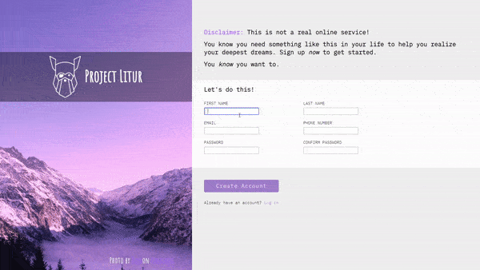

# Sign Up Form
This is a sample sign up form for a product or company 

**Link to project:** https://johnsebastian3.github.io/sign-up-form/

## How It's Made:

**Tech used:** HTML, CSS

This was built using CSS Grid and Flex for the form. 

## Optimizations

This could further be optimized by refactoring code and adding additional browser support.

## Lessons Learned:

I learned a lot about form validation from this project. I had to make sure how to style the inputs for valid and invalid inputs. It was interesting to find a balance between the invalid input errors being helpful or getting in the way.

